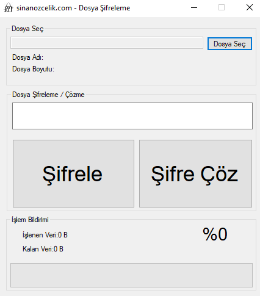
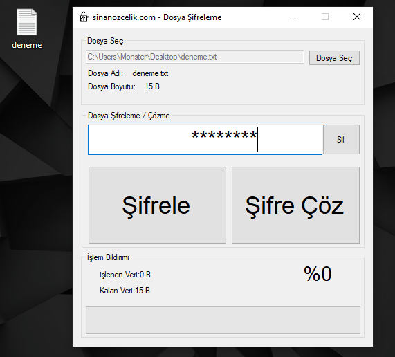
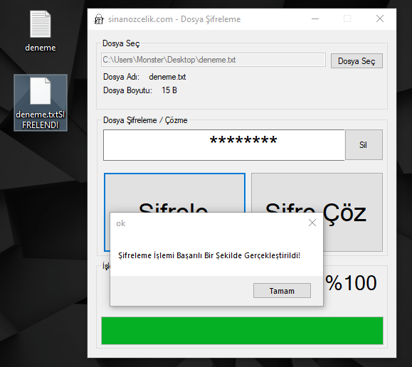
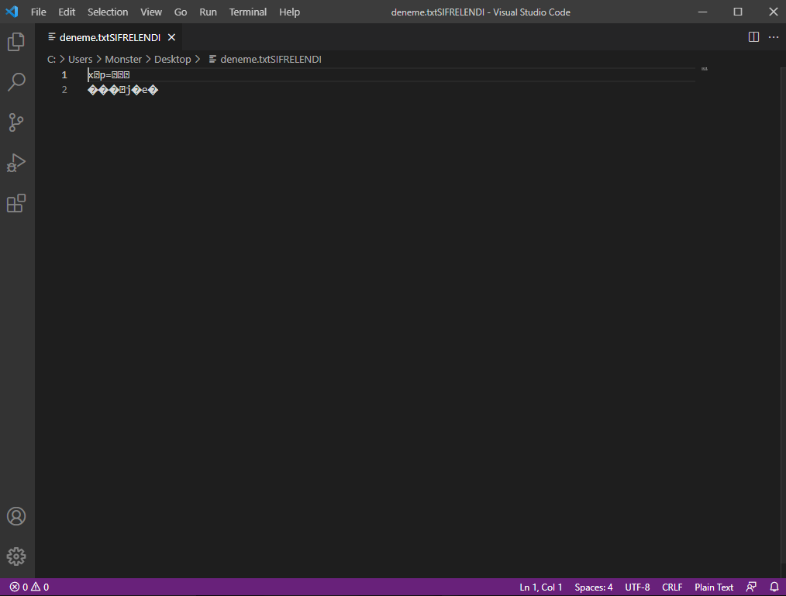
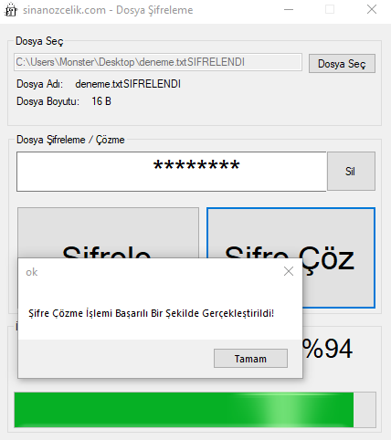
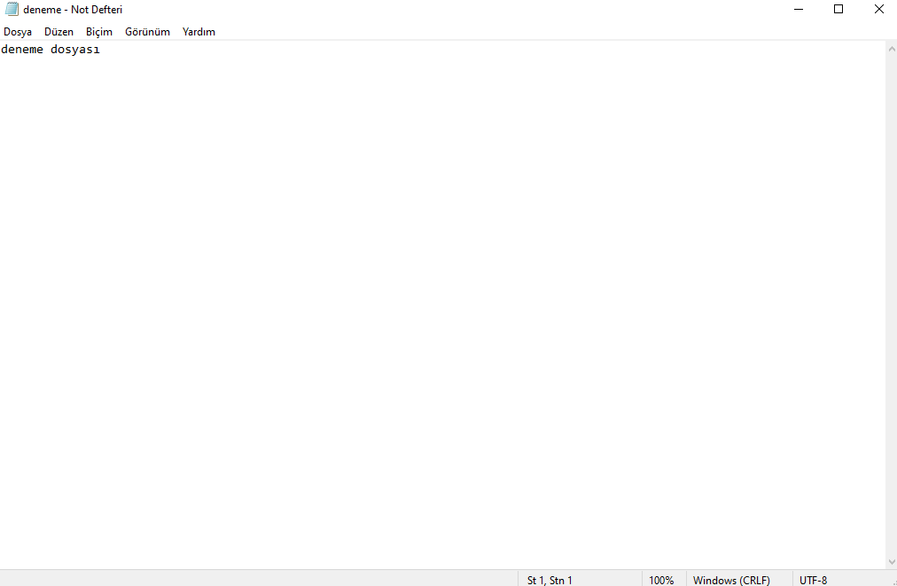

# File Encryption Application

It is based on C# and encrypts the files with the password you specify, and if the encrypted file is to be decrypted later, the encryption algorithm applied with the decryptor step is decrypted.

The encrypted file is very difficult to read and decrypt.

According to the algorithm, it can only be decrypted with the same password as this program.

After the file is encrypted, it will create an encrypted copy of the original file.

Contact e-mail for any question: info@sinanozcelik.com

For more: sinanozcelik.com

# Images from within the application

## Image of C# Application

## File Encryption Step

## Performing File Encryption

## Encrypted Content of Example File

## Decrypting Encrypted File

## Sample File
